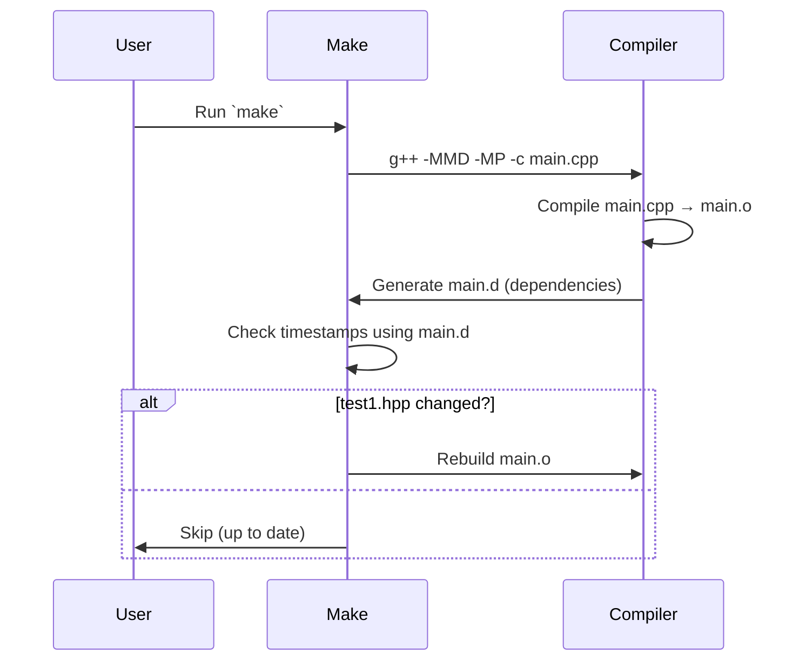
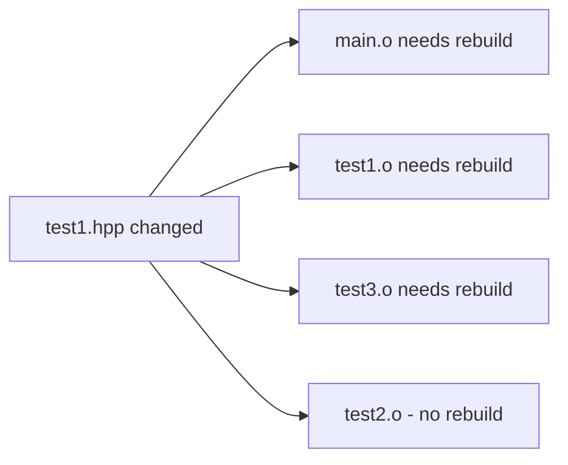
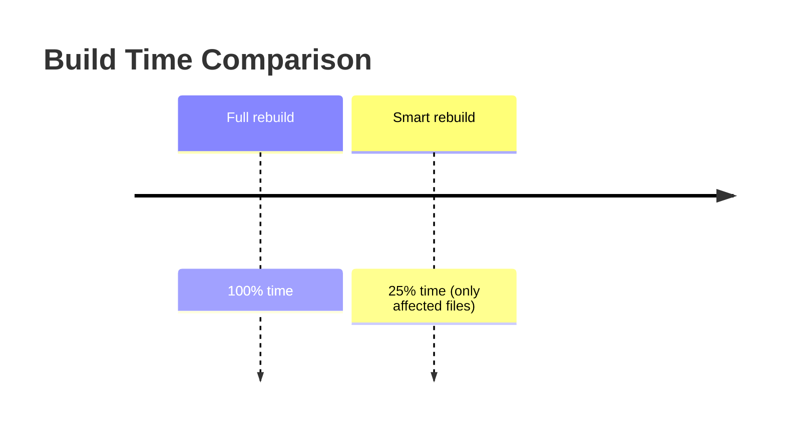

```mermaid
sequenceDiagram
    participant User
    participant Make
    participant Compiler

    User->>Make: Run `make`
    Make->>Compiler: g++ -MMD -MP -c main.cpp
    Compiler->>Compiler: Compile main.cpp → main.o
    Compiler->>Make: Generate main.d (dependencies)
    Make->>Make: Check timestamps using main.d
    alt test1.hpp changed?
        Make->>Compiler: Rebuild main.o
    else
        Make->>User: Skip (up to date)
    end
```
```


```

```mermaid
graph LR
    A[test1.hpp changed] --> B[main.o needs rebuild]
    A --> C[test1.o needs rebuild]
    A --> D[test3.o needs rebuild]
    A --> E[test2.o - no rebuild]
```
```


```

```mermaid
timeline
    title Build Time Comparison
    Full rebuild : 100% time
    Smart rebuild : 25% time (only affected files)
```